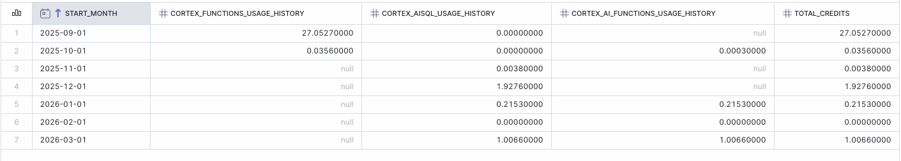

# Snowflake AI Cost Monitoring App

A comprehensive Streamlit dashboard for monitoring and analyzing Snowflake AI service costs in near real-time. This application provides detailed insights into credit consumption across all Snowflake Cortex AI services with timezone-aware filtering and interactive visualizations.

## 😑 Why this app exists

1. Admin Cost-management on UI of Snowflake has big latency and does not pull from the same SNOWFLAKE.ACCOUNT_USAGE views, which prevent in-time response to overconsumption (there is no Resource-Monitoring applicable on AI consumption either, only Budget, with no ability to auto-suspend on consumption).

2. Many ACCOUNT_USAGE views from Snowflake have evolved throughout recent changes without full backfill migration, so if you rely on some views alone without combining them, you will get wrong results.

Case in point:
- `CORTEX_FUNCTIONS_QUERY_USAGE_HISTORY` and `CORTEX_FUNCTIONS_USAGE_HISTORY` are now deprecated, to be replaced by `CORTEX_AISQL_USAGE_HISTORY` [(per Snowflake doc)](https://docs.snowflake.com/en/sql-reference/account-usage/cortex_aisql_usage_history)
- `CORTEX_AI_FUNCTIONS_USAGE_HISTORY` is recently added and aligns with how token count is charged per workload (complementary to `CORTEX_AISQL_USAGE_HISTORY`), however backfill is not complete on this view so using it alone leads to missing data.



<details>
  <summary> 🔥 Click here for the SQL query to check for your instance 🔥 </summary>

```sql
with ai_sql as (
    select 
        usage_time::date as start_date,
        'cortex_aisql_usage_history' as service_name,
        round(sum(token_credits),2) as total_credits
    from snowflake.account_usage.cortex_aisql_usage_history
    group by all
),
ai_func as (
    
    select 
        start_time::date as start_date,
        'cortex_ai_functions_usage_history' as service_name,
        round(sum(credits), 2) as total_credits
    from snowflake.account_usage.cortex_ai_functions_usage_history
    group by all

),
legacy as (
    select 
        start_time::date as start_date,
        'cortex_functions_usage_history' as service_name,
        round(sum(token_credits), 2) as total_credits
    from snowflake.account_usage.cortex_functions_usage_history
    group by all
)

-- select min(start_date) as min_date, max(start_date) as max_date, sum(total_credits) as credits, service_name from legacy group by all
-- union all
-- select min(start_date) as min_date, max(start_date) as max_date, sum(total_credits) as credits, service_name from ai_sql group by all
-- union all
-- select min(start_date) as min_date, max(start_date) as max_date, sum(total_credits) as credits, service_name from ai_func group by all
-- ;
select
    date_trunc(month, coalesce(ai_sql.start_date, ai_func.start_date, legacy.start_date)) as start_month,
    sum(legacy.total_credits) as cortex_functions_usage_history,
    sum(ai_sql.total_credits) as cortex_aisql_usage_history,
    sum(ai_func.total_credits) as cortex_ai_functions_usage_history,
    sum(coalesce(legacy.total_credits, ai_sql.total_credits, ai_func.total_credits)) as total_credits
from ai_sql
full join ai_func on ai_sql.start_date = ai_func.start_date
full join legacy on ai_sql.start_date = legacy.start_date
group by all
```

</details>    

## 🚀 Features

- **Comprehensive AI Cost Tracking**: Monitor costs across all Snowflake AI services including:
  - Cortex AI Functions & SQL
  - Cortex REST API (with custom pricing calculations)
  - Cortex Code (CLI & Snowsight)
  - Cortex Agents
  - Cortex Analyst
  - Cortex Search
  - Document Processing
  - Fine-Tuning
  - Provisioned Throughput
  - Snowflake Intelligence

- **Interactive Filtering**:
  - Multi-timezone support (UTC, Singapore, US Eastern/Pacific, Europe/London, Australia/Sydney)
  - Flexible date range selection
  - Real-time data updates

- **Rich Visualizations**:
  - Service-level cost breakdown with bar charts
  - User consumption analysis
  - Model-specific credit usage
  - Token consumption metrics

- **User Analytics**: Track top spenders and analyze usage patterns by user and service

## 📋 Prerequisites

- Snowflake account with access to `ACCOUNT_USAGE` views
- Appropriate privileges to query Snowflake system tables
- Streamlit environment (local or Snowflake Streamlit-in-Snowflake)

## 🛠️ Setup

### Option 1: Running in Snowflake (Streamlit-in-Snowflake)

1. Upload the `streamlit_app.py` file to your Snowflake Streamlit app
2. Upload the `.streamlit/config.toml` configuration file
3. The app will automatically use the active Snowflake session

### Option 2: Running Locally

1. Clone this repository:
   ```bash
   git clone https://github.com/il-hanna/snowflake-ai-cost-monitoring-app.git
   cd snowflake-ai-cost-monitoring-app
   ```

2. Install dependencies:
   ```bash
   pip install streamlit pandas snowflake-snowpark-python
   ```

3. Configure your Snowflake connection (ensure you have access to ACCOUNT_USAGE views)

4. Run the application:
   ```bash
   streamlit run streamlit_app.py
   ```

## 🏗️ Architecture

### Data Sources

The application consolidates data from multiple Snowflake ACCOUNT_USAGE views:

- `CORTEX_AISQL_USAGE_HISTORY`
- `CORTEX_AI_FUNCTIONS_USAGE_HISTORY`
- `CORTEX_FUNCTIONS_USAGE_HISTORY`
- `CORTEX_REST_API_USAGE_HISTORY`
- `CORTEX_CODE_SNOWSIGHT_USAGE_HISTORY`
- `CORTEX_CODE_CLI_USAGE_HISTORY`
- `CORTEX_AGENT_USAGE_HISTORY`
- `CORTEX_ANALYST_USAGE_HISTORY`
- `CORTEX_SEARCH_SERVING_USAGE_HISTORY`
- `CORTEX_DOCUMENT_PROCESSING_USAGE_HISTORY`
- `CORTEX_FINE_TUNING_USAGE_HISTORY`
- `CORTEX_PROVISIONED_THROUGHPUT_USAGE_HISTORY`
- `SNOWFLAKE_INTELLIGENCE_USAGE_HISTORY`

### Key Technical Features

- **Master CTE Pattern**: Uses Common Table Expressions to consolidate data from multiple usage history views
- **Custom REST API Pricing**: Implements custom pricing logic for Cortex REST API based on token types and models
- **Timezone Handling**: Converts Snowflake's LTZ (Local Time Zone) to user-selected timezones
- **Data Consolidation**: Merges legacy and current usage views for comprehensive coverage

## 📊 Dashboard Sections

1. **AI Cost Overview**: Grand total and service breakdown
2. **Cortex AI Functions & SQL**: Function-specific usage and model breakdown
3. **Cortex Code**: CLI and Snowsight usage tracking
4. **Cortex Agents**: Agent usage and request metrics
5. **Document Processing**: Page processing and credit consumption
6. **Cortex REST API**: Custom-calculated costs with pricing estimates
7. **Top User Consumption**: User-level analysis and spending patterns

## ⚙️ Configuration

### Streamlit Configuration (`.streamlit/config.toml`)

```toml
[snowflake]
[snowflake.sleep]
streamlitSleepTimeoutMinutes = 2
```

This configuration sets the sleep timeout for Snowflake Streamlit apps to 2 minutes.

## 📈 Usage

1. **Select Timezone**: Choose your preferred timezone from the sidebar dropdown
2. **Set Date Range**: Use the date picker to specify the analysis period (defaults to last 30 days)
3. **View Metrics**: Monitor the overview section for total AI credit consumption
4. **Analyze by Service**: Examine individual service sections for detailed breakdowns
5. **User Analysis**: Review the user consumption section to identify top spenders

## ⚠️ Important Notes

- **REST API Pricing**: The Cortex REST API costs are calculated estimates based on Snowflake's published pricing. Actual billing may vary.
- **Data Freshness**: Account usage views may have latency; data is typically available within 45 minutes to 3 hours.
- **Permissions**: Requires appropriate privileges to access ACCOUNT_USAGE schema views.

## 🤝 Contributing

Feel free to submit issues and enhancement requests!
